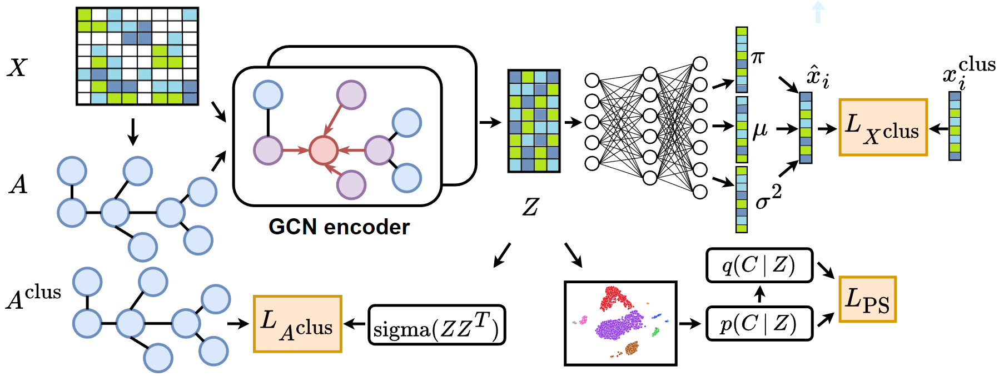

# Exploring the Interaction between Local and Global Latent Configurations for Clustering Single-cell RNA-seq: A Unified Perspective
We propose a novel approach that explores the interaction between local and global
latent configurations to progressively adjust the reconstruction
and embedding clustering tasks. We elaborate a topological
and probabilistic filter to mitigate Feature Randomness and
a cell-cell graph structure and content correction mechanism
to counteract Feature Drift. The Zero-Inflated Negative Binomial
model is also integrated to capture the characteristics of
gene expression profiles. We conduct detailed experiments on
eight real-world datasets from multiple representative genome
sequencing platforms. Our approach outperforms the state-of-the-
art clustering methods in various evaluation metrics.

# Architecture
The neural network architecture of our approach, the pretraining, the clustering training as well as the topological and probabilistic filter are defined in sctpf.py.


# Requirements 
Installing the requirements using pip 

```
$ pip install -r requirements.txt
```
Compile the C++ code for computing the largest connected components. If your python version is not 3.8, please modify the command inside compile_pers_lib.sh. 
```
$ cd ref
$ ./compile_pers_lib.sh
```

# Usage 
To evaluate our approach on each of the eight datasets, run the python scripts main_$dataset_name$.py. 
The following is a list of all the scripts:

main_Muraro.py; main_Plasschaert.py; main_Qx_LM.py; main_QS_Diaphragm.py; main_QS_Heart.py; main_QS_LM.py ;main_Wang_Lung.py; main_Young.py  

```
$ python main_Muraro.py  --k_cc=2 --threshold_2=0.7
```
The best hyperparameters are used by default.

# Arguments 
The topological  and probabilistic filter rely on two hyperparameters:   

* threshold_2: The threshold over which the soft assignment is considered  with high confidence(epsilon in Algorithm 1 of the paper)

* k_cc: The parameter used to build the k-nn graph(k in  Algorithm 1 of the paper )

# Citation
@inproceedings{mrabah2023exploring,
  title={Exploring the interaction between local and global latent configurations for clustering single-cell RNA-seq: a unified perspective},
  author={Mrabah, Nairouz and Amar, Mohamed Mahmoud and Bouguessa, Mohamed and Diallo, Abdoulaye Banire},
  booktitle={Proceedings of the AAAI Conference on Artificial Intelligence},
  volume={37},
  number={8},
  pages={9235--9242},
  year={2023}
}
